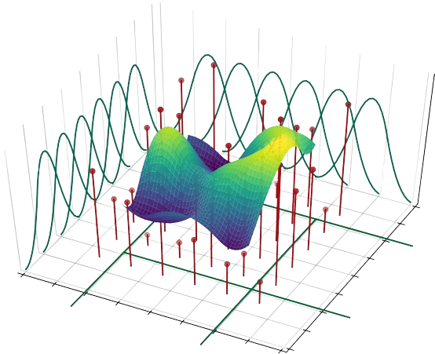
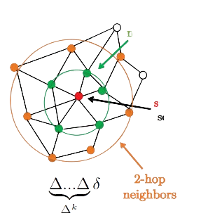

    

<h2 align="center">Neural Network Graph Learning</h2>

This notebook contains the implementations of different deep learning algorithms applied on graphs.This includes implementations of SDNE and LINE, which fall under deep node embeddings. Both these embedding models are built in Tensorflow and rely on 2 order neighbors for generating the node representations. The intrinsic model is a simple linear Dense model with softmax activation to generate the embedding space.Post that there is an indepth implementation of Graph Neural Network architectures particularly suited for classifying node embedding representation from any networkx graph.This follows Thimas Kpif's vanilla spectral GCN, along with other variations of Spectral GNN including Laplacian GCN, Spline GCN and ChebNets. The implementations are also in Tensorflow /Keras.The following are the contents of the notebook:

## Embeddings

### SDNE (Structural Deep Network Embeddings)

Resources

- [Paper](http://www.kdd.org/kdd2016/papers/files/rfp0191-wangAemb.pdf)
- [Github](https://github.com/suanrong/SDNE)

### LINE (Large Scale Information Network Embedding)

Resources

- [Paper](https://arxiv.org/abs/1503.03578v1)
- [Github](https://github.com/tangjianpku/LINE)

## Spectral Graph Neural 

### Vanilla GNN

Resources

- [Paper](https://arxiv.org/abs/1609.02907)
- [Github](https://github.com/tkipf/gcn)

### Spline GCN

Resources

- [Paper](https://openaccess.thecvf.com/content_cvpr_2018/papers/Fey_SplineCNN_Fast_Geometric_CVPR_2018_paper.pdf)
- [Code](https://paperswithcode.com/paper/splinecnn-fast-geometric-deep-learning-with/review/)

### Laplacian GCN

- [Paper](https://arxiv.org/abs/1809.09839)

### ChebNets GCN

- [Paper](https://arxiv.org/abs/1911.05467)
- [Code](https://github.com/rusty1s/pytorch_geometric)

